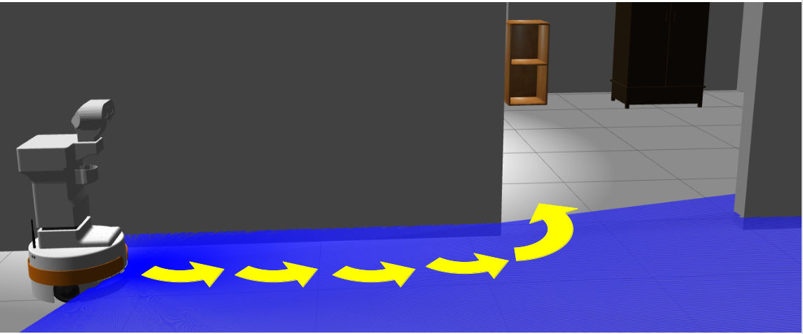

# Follow Wall Algorithm

## Algorithm explanation
Consists in a simple curvature algorithm. As simple as: If there is something at front, turn LEFT since there is some space to go. Then it follows a curved path until it converges on a wall. If for 16 seconds it fails to converge on a wall, it automatically increases the amplitude of the curve in order to converge.
This can avoid every obstacle and wall shapes. It's simply and robust. 

## Video demostration

[](https://www.youtube.com/watch?v=dGz5tjBB1bg)

## Running on Kobuki with rplidar2
To run on Kobuki robot you must change to kobuki_rplidar2 branch. 

[](https://youtu.be/w3kmItsOkaQ)

[](https://youtu.be/q3IsOkEe32M)

[](https://youtu.be/7WgDnxEBMi0)

## How to use

Create the node:
```
auto node = std::make_shared<WallFollower>();
```
Because it is a lifeCycle node yo have to trigger some transitions to start moving.
```
node->trigger_transition(lifecycle_msgs::msg::Transition::TRANSITION_CONFIGURE);
node->trigger_transition(lifecycle_msgs::msg::Transition::TRANSITION_ACTIVATE);
```
As simple as call spin(). This node implements a timer inside that runs the behaviour automatically when node is ACTIVATED.
```
rclcpp::spin(node->get_node_base_interface());
```

Full main code example (follow_node_main.cpp):
```
#include <memory>
#include "practica1_pkg/WallFollower.hpp"

int main(int argc, char * argv[])
{
  rclcpp::init(argc, argv);

  auto node = std::make_shared<WallFollower>();

  node->trigger_transition(lifecycle_msgs::msg::Transition::TRANSITION_CONFIGURE);
  node->trigger_transition(lifecycle_msgs::msg::Transition::TRANSITION_ACTIVATE);

  rclcpp::spin(node->get_node_base_interface());
  rclcpp::shutdown();

  return 0;
}
```

To see it behaviour execute this
```
  ros2 launch br2_tiago sim.launch.py
  ros2 run practica1_pkg follow_wall_main
```


You must clone repo of fmrico github: planning_cognitive_systems_course to execute first line. 

#### Mantainers
<p.colmenar.2019@alumnos.urjc.es>\
<v.perezb.2019@alumnos.urjc.es>

[](https://classroom.github.com/online_ide?assignment_repo_id=6883681&assignment_repo_type=AssignmentRepo)

[](https://github.com/Docencia-fmrico/follow-wall-binaryteam)
